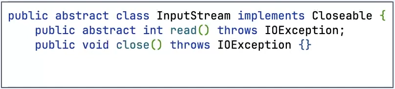
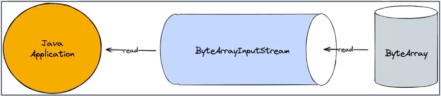
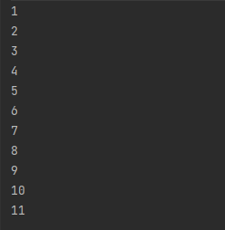
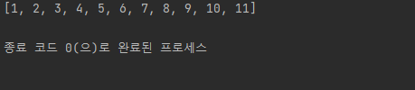
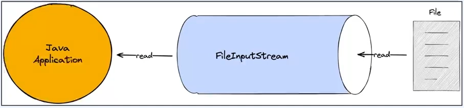
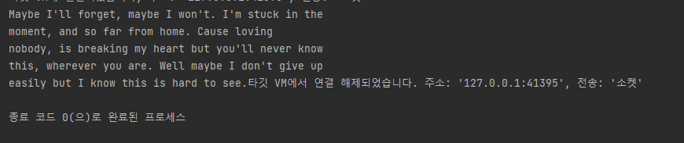
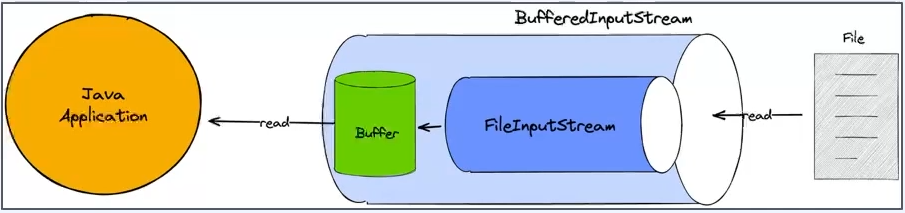

# 1) Java IO 란?
- Java 1.0에서 처음 도입
- 파일과 네트워크에 데이터를 읽고 쓸 수 있는 API 제공
- byte단위로 일고 쓸 수 있는 stream(InputStream과 OutputStream)
- blocking으로 동작


# 2) Java IO - InputStream  
> Stream이란   
> Java 8에서 등장한 함수형 프로그래밍 방식의 반복자에 대한 내용이 아니며,
> 프로그램은 외부에서 데이터를 읽거나 외부로 데이터를 출력하는 작업이 빈번하게 일어난다.
> 이때 데이터는 어떠한 통로를 통해서 데이터가 이동되는데, 이 통로를 Stream 이라고 한다.
> 자바에서 기본적으로 제공하는 I/O 기능은 java.io 패키지에서 제공하며, java.io 패키지에서는 다양한 입출력 스트림 클래스를 제공한다
> 바이트 기반 스트림은 문자, 그림, 영상 등 다양한 형태의 데이터를 주고 받으며, 문자 기반 스트림은 문자를 주고 받을 수 있다. 

- 바이트 기반 입력 스트림의 최상위 추상클래스이며, 어떤 source로 부터 데이터를 읽을지에 따라 다양한 구현체 존재  => `FileInputStream, ByteArrayInputStream, BufferedInputStream`
- Closable 구현하고 있어서 `close` 함수 가지고 있으면 InputStream의 함수 `read` 를 가지고 있다.
> `read` : stream으로 데이터를 읽고, 읽은 값을 반환, -1이라면 끝에 도달했다는 것을 의미  
> `close` : stream을 닫고 더 이상 데이터를 읽지 않는다.  



## 2-1) read
```java
class ReadTest {
	public static void main(String[] args) {
		byte[] bytes = {1, 2, 3, 4, 5, 6, 7, 8, 9, 10, 11};

		try (InputStream is = new ByteArrayInputStream(bytes)){
			int value;

			while ((value = is.read()) != -1) {
				System.out.print(value);
			}
		} catch (IOException e) {
			throw new RuntimeException(e);
		}
	}
}
```


# 3) Java IO - ByteArrayInputSteam   
- byte array로부터 값을 읽을 수 있다.
- 메모리가 source가 된다.  


<br>  

## 3-1) raad 함수  
```java
class ByteArrayInputStreamTest {
  public static void main(String[] args) {
    byte[] bytes = {1, 2, 3, 4, 5, 6, 7, 8, 9, 10, 11};
    try (InputStream is = new ByteArrayInputStream(bytes)){
      int value;

      while ((value = is.read()) != -1) {
        System.out.println(value);
      }
    } catch (IOException e) {
      throw new RuntimeException(e);
    }
  }
}
```  



## 3-2) readAllBytes 함수  
> read() 처럼 하나씩 읽는게 아니라 한번에 읽고 출력할 수 있다.
```java
class Scratch {
	public static void main(String[] args) {
		byte[] bytes = {1, 2, 3, 4, 5, 6, 7, 8, 9, 10, 11};
		try (InputStream is = new ByteArrayInputStream(bytes)) {
			byte[] values = is.readAllBytes();
			System.out.println(Arrays.toString(values));
		} catch (IOException e) {
			throw new RuntimeException(e);
		}
	}
}
```  


# 4) Java IO - FileInputStream
-  InputStream 클래스를 상속받은 자식 클래스이다.
- file로 부터 byte 단위로 값을 읽을 수 있으며, File객체나 path를 통해서 FileInputSteram을 열 수 있다.
- application에서 blocking이 일어난다.




## 4-1) File객체나 path를 통해서 stream 열기
```java
class Test {
	public static void main(String[] args) {
		File file = new File("C:\\Users\\coffe\\Desktop\\메모장.txt");
		try (FileInputStream fis = new FileInputStream(file)) {
			var value = 0;

			while ((value = fis.read()) != -1) {
				System.out.print((char) value);
			}
		} catch (Exception e) {
			e.printStackTrace();
		}
	}
}
```



##  Java IO - BufferedInputStream
> 한번 read 를 호출할 때 buffer 크기만큼 데이터가 채워지면 한번에 읽고 내부 버퍼에 읽혀진 데이터를 임시로 저장하기 때문에 파일 읽기에서 주로 사용되며 성능을 어느 정도 향상시킬 수 있다.
- 다른 InputStream과 조합해서 사용하며, BufferedInputStream은 버퍼를 이용해 입출력 성능을 최적화하는 입력 스트림다.  
  




```java
class Test {
	public static void main(String[] args) {
		File file = new File("C:\\Users\\coffe\\Desktop\\메모장.txt");

		try (FileInputStream fis = new FileInputStream(file)) {
			try (BufferedInputStream bis = new BufferedInputStream(fis)){
				var value = 0;

				while ((value = bis.read()) != -1) {
					System.out.print((char) value);
				}
			}
		} catch (Exception e) {
			e.printStackTrace();
		}
	}
}
```


