# OutPutStream
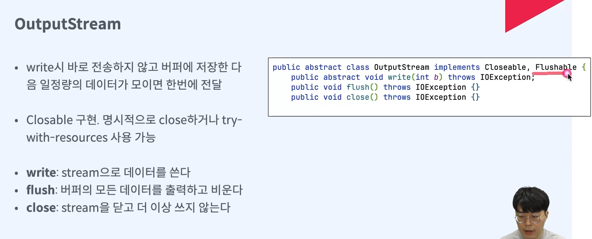
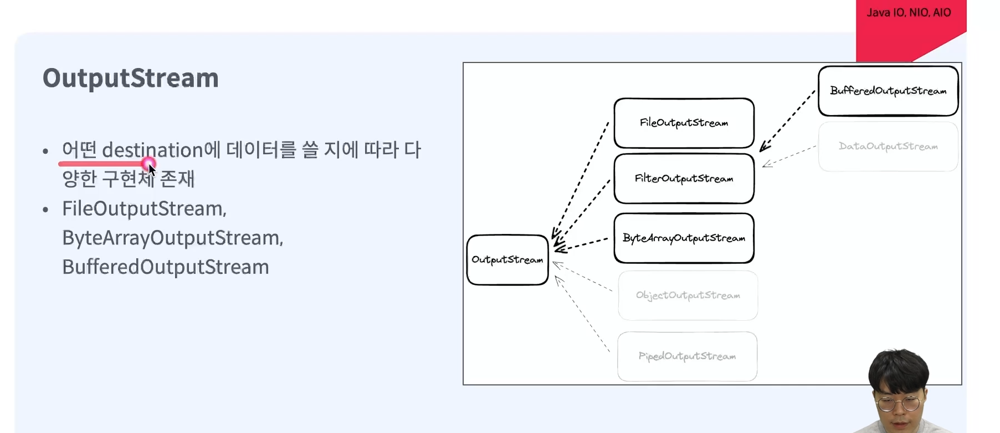

## ByteArrayOutputStream
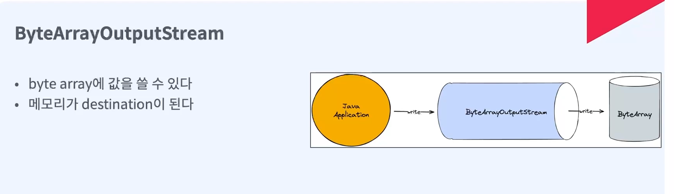
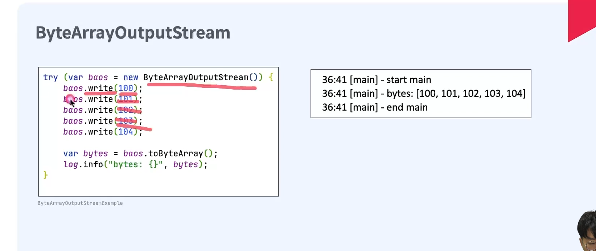

## FileOutputStream
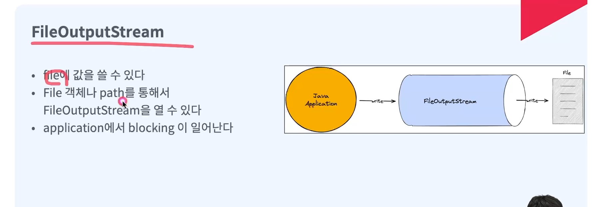
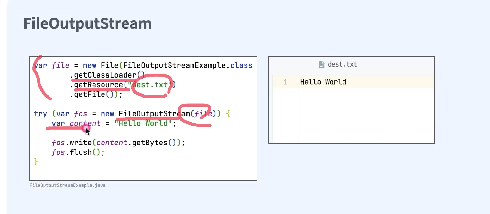

## BufferedOutputStream
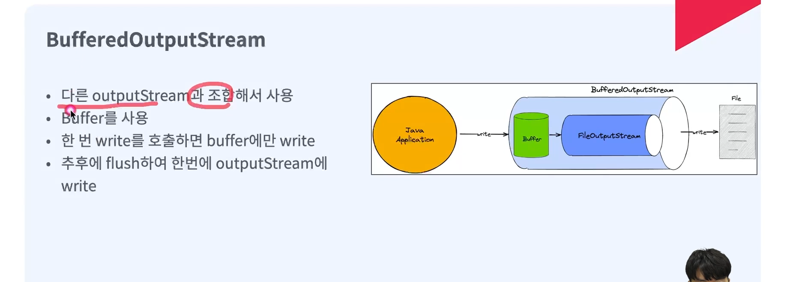
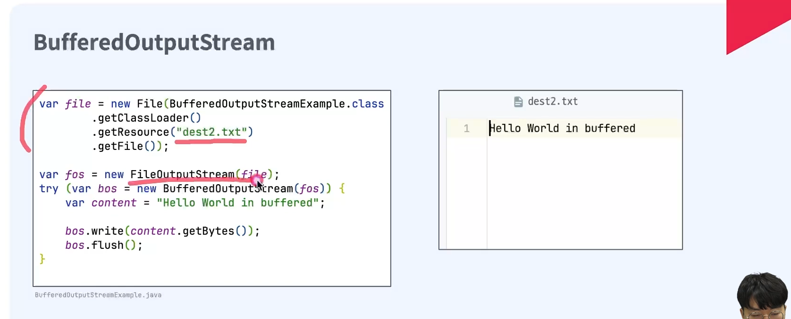

## SocketOutputStream
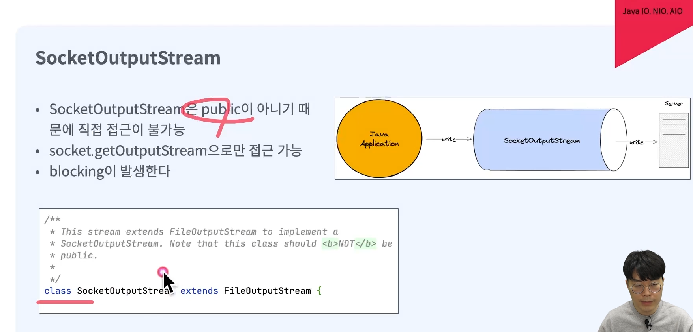
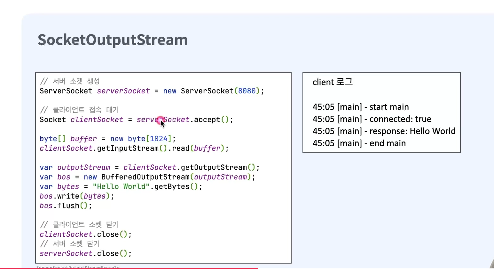

# Java IO Reader와 Writer
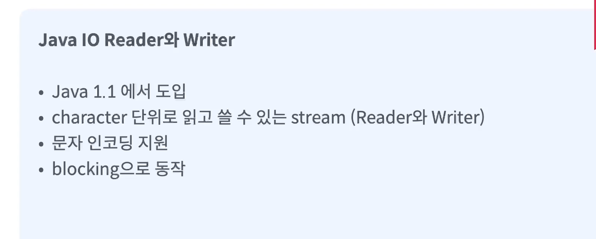

## FileReader
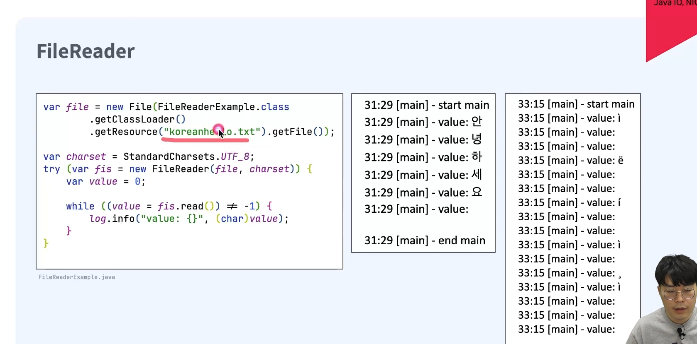

## FileWriter
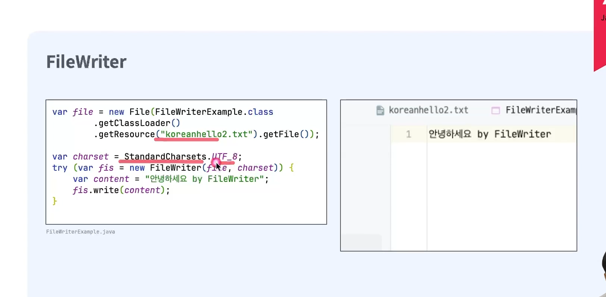

# Java IO 한계
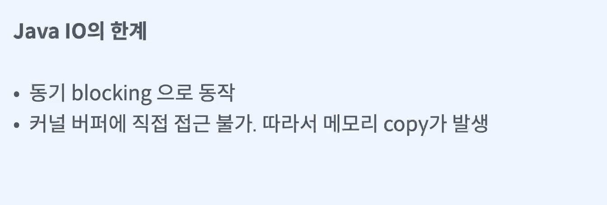

## 커널버퍼에 직접 접근 불가
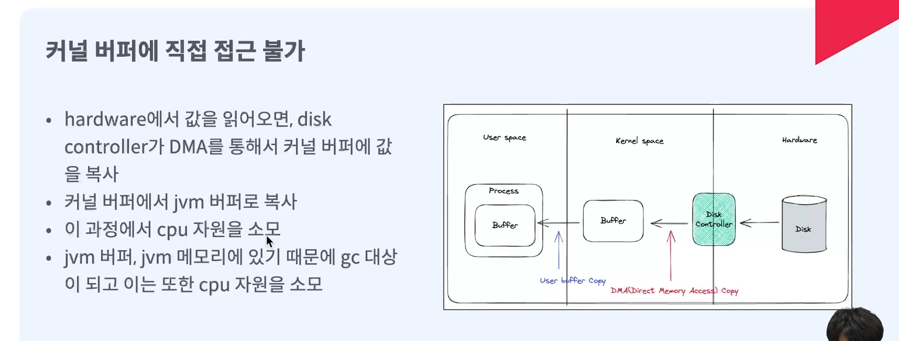
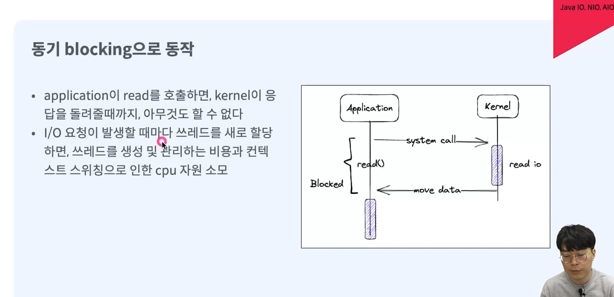

