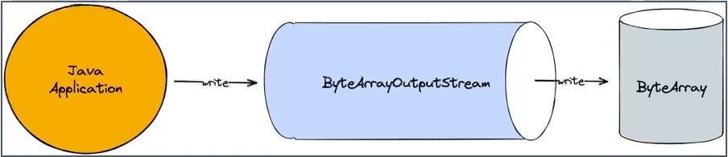
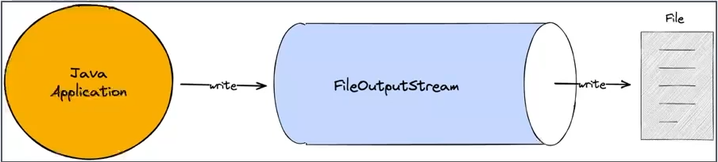
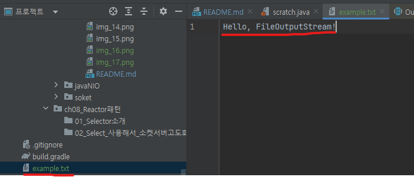
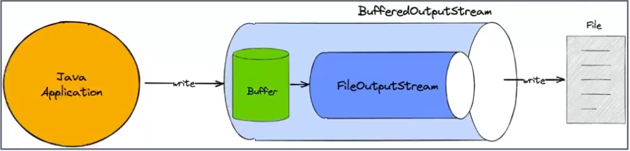
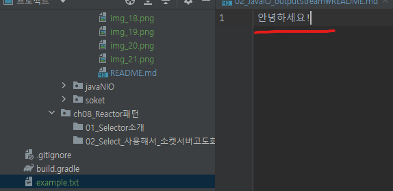

# 1.OutPutStream
> OutputStream은 외부로 데이터를 출력하는 역할을 수행한다.
- 바이트 기반 출력 스트림의 최상위 추상클래스이기 때문에 모든 바이트 기반 출력 스트림 클래스는 이 클래스를 상속 받아 기능을 재정의 한다.
- write시 바로 전송하지 않고 버퍼에 저장한다음 일정량의 데이터가 모이면 한번에 전달한다.
- Closable을 구현하고 있어 명시적으로 close 하거나 try-with-resource 사용 가능하다.

```
- write : stream으로 데이터를 쓴다.
- flush : 버퍼의 모든 데이터를 출력하고 비운다.
- close : stream을 닫고 더 이상 쓰지 않는다.
```  
<br>
<br>

## 1.1) ByteArrayOutputStream
- byte array에 값을 쓸 수 있다.  
- 메모리가 destination이 된다.

```
일반적으로 입출력 스트림을 사용할 때, 
파일이나 네트워크 연결과 같은 외부 리소스를 사용하는 경우
close 메서드를 호출하여 해당 리소스를 해제하고 
관련된 자원을 정리하지만 

ByteArrayOutputStream 클래스는 
메모리 내의 바이트 배열에 데이터를 쓰는데 사용되며, 
이 데이터를 저장하기 위한 별도의 자원이나 외부 파일과 같은 리소스를 차지하지 않는다.
따라서 close 메서드를 호출하는 것은 큰 의미가 없다
```



- 예제  
```java
class Test {
    public static void main(String[] args) {
        String data = "Hello, ByteArrayOutputStream!";
        byte[] byteArray;

        try (ByteArrayOutputStream baos = new ByteArrayOutputStream()) {
            baos.write(data.getBytes()); // 문자열을 바이트 배열로 변환하여 쓰기
            System.out.println(baos);  // Hello, ByteArrayOutputStream!

            byteArray = baos.toByteArray(); // ByteArrayOutputStream의 내용을 바이트 배열로 얻기
            for (byte b : byteArray) {
                System.out.print((char) b); // Hello, ByteArrayOutputStream!
            }

        } catch (Exception e) {
            e.printStackTrace();
        }
    }
}
```

<br>
<br>


## 1.2) FileOutputStream
- 파일로 부터 바이트 단위로 저장하는 클래스
- 파일객체나 path를 통해서 FileOutputStream을 열 수 있다 하지만 파일이 존재하지 않으면 FileNotFoundException이 발생
- application에서 blocking이 일어난다. 



> 주의할 점은 FileOutputStream을 사용할 때 파일을 덮어쓸 경우 이전 내용이 삭제된다.  
파일을 덮어쓰지 않고 이어서 데이터를 추가하려면 다른 생성자를 사용하거나  
FileOutputStream 객체를 생성할 때 두 번째 매개변수로 true를 전달하여  
파일을 추가 모드로 열 수 있다.

- 예제
```java
class Test {
    public static void main(String[] args) {
        String data = "Hello, FileOutputStream!";
        try (FileOutputStream fos = new FileOutputStream("C:\\Users\\coffe\\Documents\\practice\\study\\part1\\example.txt")) {
            // 문자열 데이터를 파일에 쓰기
            fos.write(data.getBytes());
        } catch (IOException e) {
            e.printStackTrace();
        }
    }
}
```  


- 파일을 추가 모드
> FileOutputStream 인자에 true도 주면 파일 추가모드로 데이터를 덮어씌우지 않는다.
```java
class Test {
    public static void main(String[] args) {
        String data = "Hello, FileOutputStream!";
        try (FileOutputStream fos = new FileOutputStream("C:\\Users\\coffe\\Documents\\practice\\study\\part1\\example.txt", true)) {
            // 문자열 데이터를 파일에 쓰기
            fos.write(data.getBytes());
        } catch (IOException e) {
            e.printStackTrace();
        }
    }
}
```  

<br>
<br>


## 1.3) BufferedOutputStream
- Buffer를 사용하며, 입출력 효율을 향상시키고 다른 outputStream과 조합해서 사용한다.
- 한 번 write를 호출하면 buffer에만 write하고 이후에 flush하여 한번에 outputStream에 write 한다.  

   

- 예제
```java
class Test {
    public static void main(String[] args) {
        try (FileOutputStream fos = new FileOutputStream("C:\\Users\\coffe\\Documents\\practice\\study\\part1\\example.txt");
             BufferedOutputStream bos = new BufferedOutputStream(fos)) {
            // 문자열 데이터를 버퍼에 쓰기
            bos.write("Hello, BufferedOutputStream!".getBytes());
            bos.write("\n 버퍼에 저장되어 있는 상태".getBytes());

            // flush 메서드를 호출하여 데이터를 실제 파일에 출력
            bos.flush();
        } catch (IOException e) {
            e.printStackTrace();
        }
    }
}
```

<br>
<br>

---

# 2) Java IO Reader와 Writer
- java 1.1에서 도입
- character 단위로 읽고 쓸 수 잇는 stream
- 문자 인코딩 지원
- blocking으로 지원  

```
Reader와 Writer는 Java의 입출력 스트림 클래스의 문자열 버전이며, 
바이트 스트림이 아닌 문자열 데이터를 처리하기 위한 목적으로 만들어졌다.
Reader는 문자를 읽는 데 사용되고, Writer는 문자를 쓰는 데 사용된다.
```

<br>
<br>


## 2-1) FileReader
```java
class Test {
    public static void main(String[] args) {
        File file = new File("C:\\Users\\coffe\\Documents\\practice\\study\\part1\\example.txt");

        try (Reader reader = new FileReader(file, StandardCharsets.UTF_8)) {
            int charCode;
            while ((charCode = reader.read()) != -1) {
                char character = (char) charCode;
                System.out.print(character);
            }
        } catch (IOException e) {
            e.printStackTrace();
        }
    }
}
```

<br>
<br>

## 2-2) FileWriter
```java
class Test {
    public static void main(String[] args) {
        File file = new File("C:\\Users\\coffe\\Documents\\practice\\study\\part1\\example.txt");

        try (Writer writer = new FileWriter(file, StandardCharsets.UTF_8)) {
            writer.write("안녕하세요!");
        } catch (IOException e) {
            e.printStackTrace();
        }
    }
}
```  


<br>
<br>

---

# 3) Java IO 한계
- 동기 blocking으로 동작한다.
- 커널 버퍼에 직접 접근이 불가. 따라서 메모리 copy가 발생한다.

<br>
<br>


## 3-1) 커널버퍼에 직접 접근 불가 
하드웨어에서 값을 읽어오면 diskController가 DNA를 통해서 커널 버퍼에 값을 복사한다.  
하지만 커널 버퍼에 직접 접근이 불가능하기 때문에 커널 버퍼에서 jvm버퍼로 복사를 하게 되는데  
jvm 메모리에 있기 때문에 gc 대상이 되어 이 과정에서 cpu자원을 소모하게 된다. 

<br>
<br>


## 3-2) 동기 blocking으로 동작한다.
application이 read를 호출하면, 커널이 응답을 돌려줄 때 까지 아무것도 할 수 없는데 I/O 요청이 발생할 때마다  
쓰레드를 새로 할당하면, 쓰레드를 생성 및 관리하는 비용과 컨텍스트 스위칭으로 인한 cpu자원소모가 발생한다.


```
프로그래밍에서 Context는 (동작, 작업들의 집합)을 (정의, 관리, 실행)하도록 
하는 (최소한의 상태, 재료, 속성)을 포함하는 (객체, 구조체, 정보)인데
작업의 주체가 현재 Context를 잠시 중단하고 다른 Context를 실행하는 것을 Context Switching이라 한다.

출처 : https://velog.io/@curiosity806/Context-Switching%EC%9C%BC%EB%A1%9C-%EC%95%8C%EC%95%84%EB%B3%B4%EB%8A%94-process%EC%99%80-thread#1-context%EB%9E%80
```


