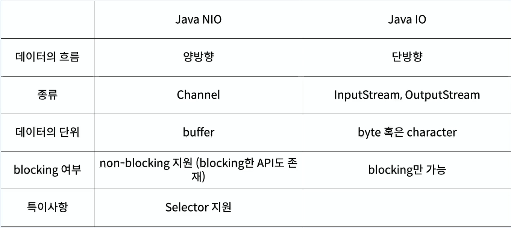
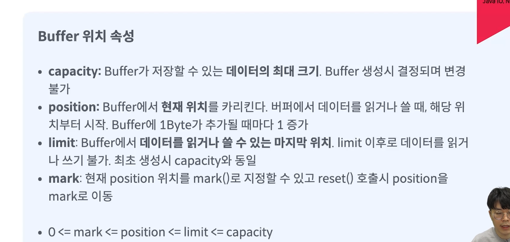

# 1) Java NIO
> Java New Input / Output
- java 1.4에서 처음 도입
- 파일과 네트워크에 데이터를 읽고 쓸 수 있는 API제공
- buffer 기반
- non-blocking 지원
- selector, channel 도입으로 높은 성능 보장


### ⭐️ 배경
```
C/C++처럼 직접 메모리를 관리하고 운영체제 수준의 시스템 콜을 직접 사용 할 수 없기에 
커널 버퍼에서 JVM내의 Buffer로 한번 더 데이터를 옮겨주는 과정이 생기면서 발생되는 문제점인 
JVM 내부 버퍼로 복사 시 발생하는 CPU연산, GC관리, IO요청에 대한 스레드 블록이 발생하게 되는
현상때문에 효율이 좋지 못한점을 개선하기 위해 나온 패키지이다.
```


### ⭐️ 주요 구성 요소와 개념
```
1. 버퍼 (Buffer): 데이터를 읽고 쓰는 데 사용되는 메모리 영역
   NIO는 데이터를 버퍼에 읽어들이고, 버퍼에서 데이터를 읽어오는 방식으로 작동한다.

2. 채널 (Channel): 입출력 작업을 수행하는 데 사용되는 추상적인 개념
   채널은 파일, 네트워크 소켓, 파일 디스크립터 등 다양한 입출력 소스와 연결될 수 있다.

3. 셀렉터 (Selector): 다중 채널 관리를 위한 도구로, 여러 채널을 감시하고 그 중에서 입출력 가능한 채널을 식별할 수 있다.
```


<br>
<br>


## 1-1) Java NIO vs Java IO

  
<br>
<br>

--- 

# 2) channel과 Buffer
### ⬜️ channel
> java IO에서 Stream은 파일을 읽기 위한 InputStream 쓰기 위한 OutputStream 객체가 별도로 존재해 단방향으로 흐르지만 NIO의 채널은  
> 채널 하나로 읽기와 쓰기를 사용하는 양방향이 가능하다. 채널은 ByteChannel, FileChannel SocketChannel 등 이 존재한다.  


### ⬜️ Buffer  
> 버퍼(Buffer)는 저장되는 데이터 타입에 따라 분류될 수 있고, 어떤 메모리를 사용하느냐에 따라 다이렉트(Direct)와 넌다이렉트(NonDirect)로 분류할 수도 있다.    
> NonDirect 버퍼는 JVM이 관리하는 힙 메모리 공간을 이용하는 버퍼이고, Direct 버퍼는 운영체제가 관리하는 메모리 공간을 이용하는 버퍼이다.  

  
⭕️ ByteBuffer: 가장 일반적으로 사용되는 버퍼 클래스로, 바이트 데이터를 다룰 때 사용되고 파일 입출력, 네트워크 통신 등 다양한 곳에서 활용.    
⭕️ CharBuffer: 문자(char) 데이터를 다루는 데 사용되며, 문자 인코딩 및 디코딩 작업에 적합  
⭕️ ShortBuffer: 2바이트(short) 데이터를 다루는 데 사용  
⭕️️ IntBuffer: 4바이트(int) 데이터를 다루는 데 사용  
⭕️ LongBuffer: 8바이트(long) 데이터를 다루는 데 사용    
⭕️ FloatBuffer: 4바이트(float) 데이터를 다루는 데 사용    
⭕️ DoubleBuffer: 8바이트(double) 데이터를 다루는 데 사용

## 2-2) Buffer 위치 속성
 