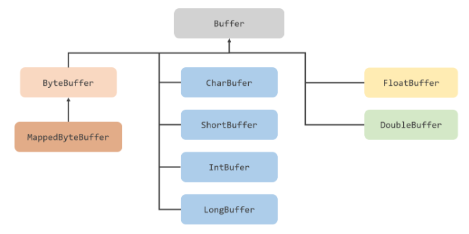
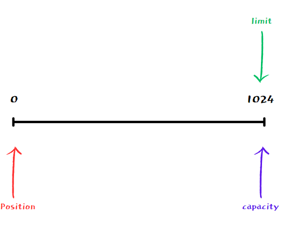
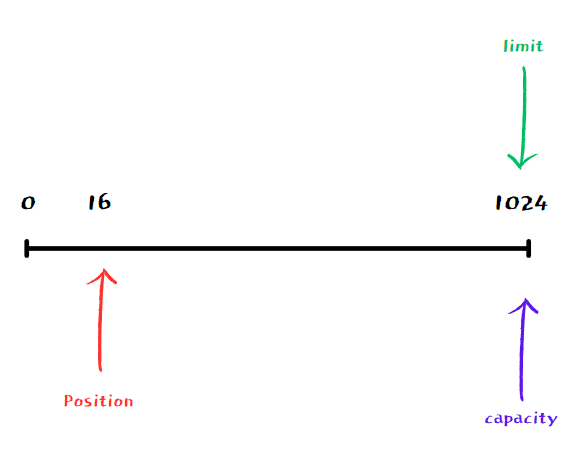
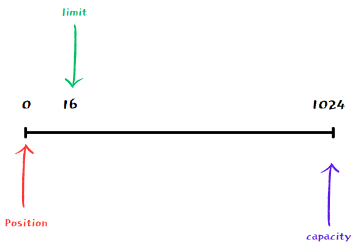
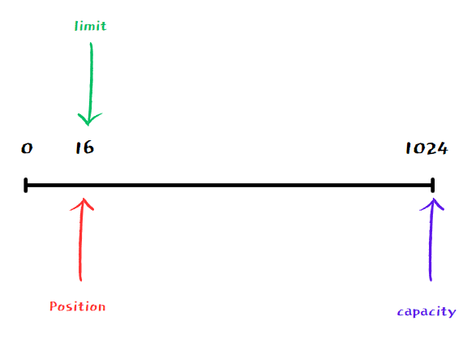

# 1) Java NIO
> Java New Input / Output
- java 1.4에서 처음 도입
- 파일과 네트워크에 데이터를 읽고 쓸 수 있는 API제공
- buffer 기반
- non-blocking 지원
- selector, channel 도입으로 높은 성능 보장


### ⭐️ 배경
```
C/C++처럼 직접 메모리를 관리하고 운영체제 수준의 시스템 콜을 직접 사용 할 수 없기에 
커널 버퍼에서 JVM내의 Buffer로 한번 더 데이터를 옮겨주는 과정이 생기면서 발생되는 문제점인 
JVM 내부 버퍼로 복사 시 발생하는 CPU연산, GC관리, IO요청에 대한 스레드 블록이 발생하게 되는
현상때문에 효율이 좋지 못한점을 개선하기 위해 나온 패키지이다.
```


### ⭐️ 주요 구성 요소와 개념
```
1. 버퍼 (Buffer): 데이터를 읽고 쓰는 데 사용되는 메모리 영역
   NIO는 데이터를 버퍼에 읽어들이고, 버퍼에서 데이터를 읽어오는 방식으로 작동한다.

2. 채널 (Channel): 입출력 작업을 수행하는 데 사용되는 추상적인 개념
   채널은 파일, 네트워크 소켓, 파일 디스크립터 등 다양한 입출력 소스와 연결될 수 있다.

3. 셀렉터 (Selector): 다중 채널 관리를 위한 도구로, 여러 채널을 감시하고 그 중에서 입출력 가능한 채널을 식별할 수 있다.
```


<br>
<br>


## 1-1) Java NIO vs Java IO

  
<br>
<br>

--- 

# 2) channel과 Buffer
### ⬜️ channel
> java IO에서 Stream은 파일을 읽기 위한 InputStream 쓰기 위한 OutputStream 객체가 별도로 존재해 단방향으로 흐르지만 NIO의 채널은  
> 채널 하나로 읽기와 쓰기를 사용하는 양방향이 가능하다. 채널은 ByteChannel, FileChannel SocketChannel 등 이 존재한다.  


<br>

### ⬜️ Buffer  
> 버퍼(Buffer)는 저장되는 데이터 타입에 따라 분류될 수 있고, 어떤 메모리를 사용하느냐에 따라 다이렉트(Direct)와 넌다이렉트(NonDirect)로 분류할 수도 있다.    
> NonDirect 버퍼는 JVM이 관리하는 힙 메모리 공간을 이용하는 버퍼이고, Direct 버퍼는 운영체제가 관리하는 메모리 공간을 이용하는 버퍼이다.  

  
⭕️ ByteBuffer: 가장 일반적으로 사용되는 버퍼 클래스로, 바이트 데이터를 다룰 때 사용되고 파일 입출력, 네트워크 통신 등 다양한 곳에서 활용.    
⭕️ CharBuffer: 문자(char) 데이터를 다루는 데 사용되며, 문자 인코딩 및 디코딩 작업에 적합  
⭕️ ShortBuffer: 2바이트(short) 데이터를 다루는 데 사용  
⭕️️ IntBuffer: 4바이트(int) 데이터를 다루는 데 사용  
⭕️ LongBuffer: 8바이트(long) 데이터를 다루는 데 사용    
⭕️ FloatBuffer: 4바이트(float) 데이터를 다루는 데 사용    
⭕️ DoubleBuffer: 8바이트(double) 데이터를 다루는 데 사용

<br>
<br>

## 2-2) Buffer 위치 속성
⭕️ `capacity` : Buffer가 저장할 수 있는 데이터 최대 크기. 생성시 결정되며 변경은 불가하다.  
⭕️ `position` : Buffer에서 현재위치를 가리킨다. 버퍼에서 데이터를 읽거나 쓸 때, 해당 위치부터 시작하고 1Byte가 추가될 때마다 1 증가한다.  
⭕️ `limit` : Buffer에서 데이터를 읽거나 쓸 수 있는 마지막 위치이며, Limit 이후의 데이터는 읽거나 쓰기가 불가능하다.  
⭕️ `mark` : 현재 position 위치를 mark()로 지정할 수 있고 reset() 호출시 position 을 mark로 이동한다.  

<br>
<br>

## 2-3) 예제

⭕️ 1. `ByteBuffer byteBuffer = ByteBuffer.allocateDirect(1024);` 로 생성된 Buffer는 capacity는 초기 주어진 값으로 Limit은 capacity와 동일하고  position은 0으로 세팅된다.   



<br>

⭕️ `fileChannel.read(byteBuffer);` 로 file로부터 data wirte하여 position이 16만큼 이동할 것을 확인할 수 있다.  



<br>

⭕️ `byteBuffer.flip();` 로 flip을 호출하면 buffer의 limit 위칠르 현재 postion 위치로 이동시키고 postion을 0으로 리셋한다.   



<br>

⭕️ `CharBuffer decode = StandardCharsets.UTF_8.decode(byteBuffer);` 로 읽기모드로 전환된 buffer를 처음부터 limit까지 읽는다.   



<br>

⭕️ `byteBuffer.rewind();` 로 buffer의 limit은 유지시키고 position 위치를 0으로 리셋하여 데이터를 처음부터 다시 읽을 수 있는 상태로 돌린다.  


<br>

⭕️ `byteBuffer.clear();` 로 Buffer의 limit위치를 capacity 위치로 이동시키고 position을 0으로 리셋한다.  


<br>

```java
class Test {

	public static void main(String[] args) throws IOException {
		File file = new File("C:\\Users\\coffe\\Documents\\practice\\study\\part1\\example.txt");

		FileChannel fileChannel = FileChannel.open(file.toPath());

		ByteBuffer byteBuffer = ByteBuffer.allocateDirect(1024);
		System.out.println("allocate : " + byteBuffer);  // 1. allocate : java.nio.DirectByteBuffer[pos=0 lim=1024 cap=1024]

		// file로부터 값을 읽어서 byteBuffer에 write
		fileChannel.read(byteBuffer);
		System.out.println("write : " + byteBuffer);  // write : java.nio.DirectByteBuffer[pos=16 lim=1024 cap=1024]

		// flip()을 호출하여 읽기모드로 전환
		byteBuffer.flip();
		System.out.println("flip : " + byteBuffer); // flip : java.nio.DirectByteBuffer[pos=0 lim=16 cap=1024]

		// 읽기모드로 전환하여 처음부터 limit까지 읽음
		CharBuffer decode = StandardCharsets.UTF_8.decode(byteBuffer);
		System.out.println(decode);  // 안녕하세요!
		System.out.println("read : " + byteBuffer); // read : java.nio.DirectByteBuffer[pos=16 lim=16 cap=1024]

		byteBuffer.rewind();
		System.out.println("rewind : " + byteBuffer);  // rewind : java.nio.DirectByteBuffer[pos=0 lim=16 cap=1024]

		byteBuffer.clear();
		System.out.println("clear : " + byteBuffer); // clear : java.nio.DirectByteBuffer[pos=0 lim=1024 cap=1024]
	}
}
```


