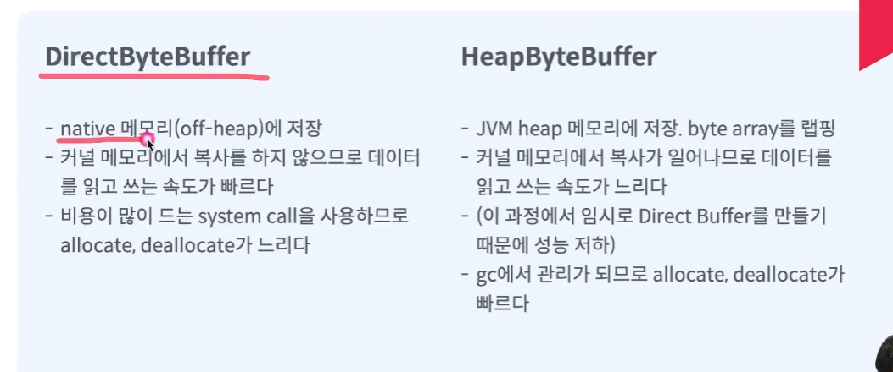
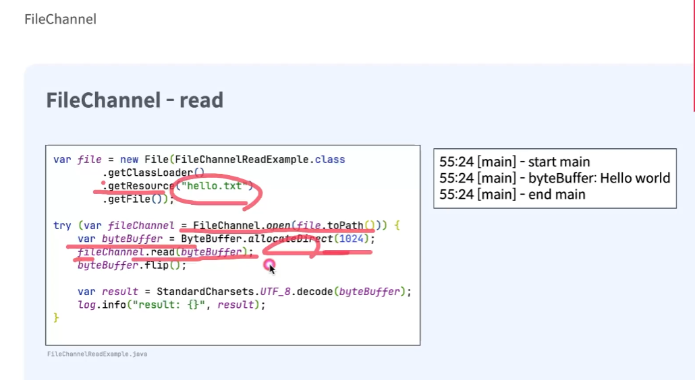
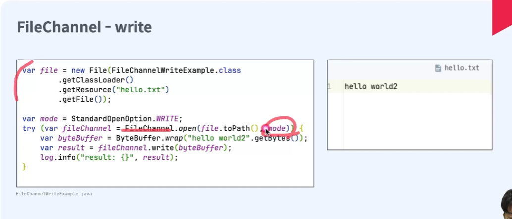
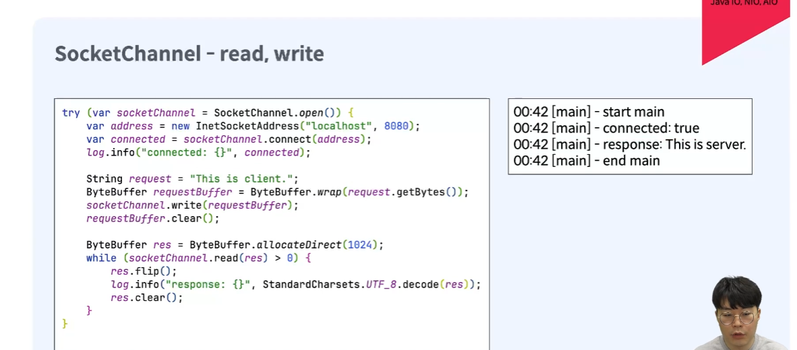
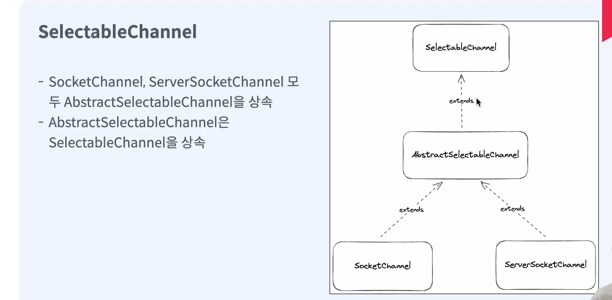
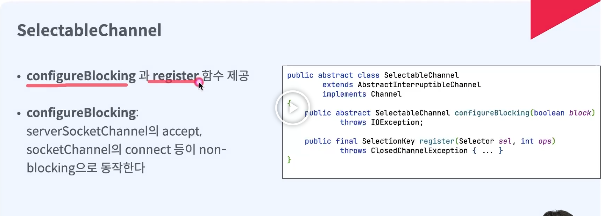
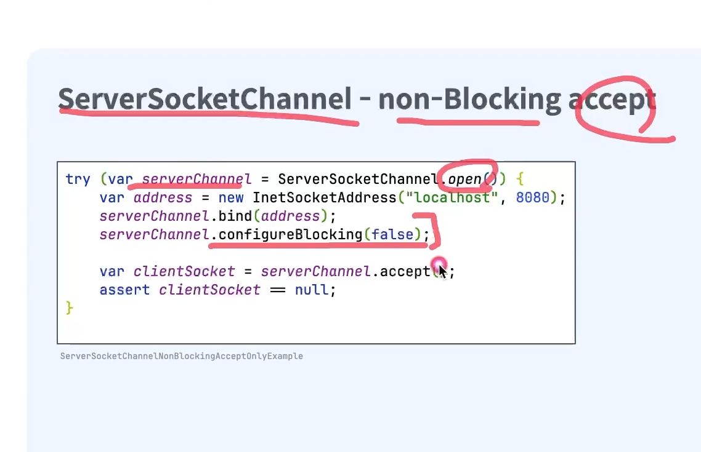
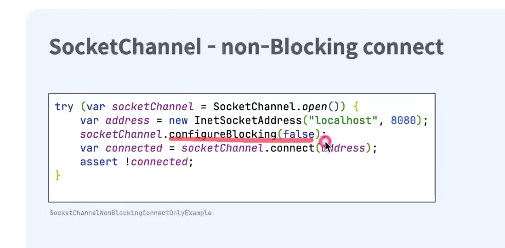

# 1) Buffer의 종류
 ## 1-1 ) DirectByteBuffer
 ## 1-2 ) HeapByteBuffer

# 2) ByteBuffer 구분

- 예제  
> read
  

> write    
  

> socketChannel - read, write   (client)

 

> socketChannel - read, write   (server)

   

# 3) SelectableChannel  

  
   

