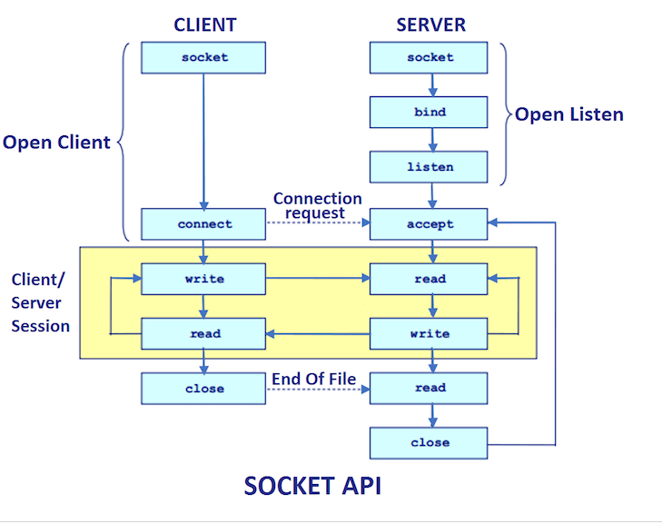

# JavaIO
- Java 1.0에서 처음 도입
- 파일과 네트워크에 데이터를 읽고 쓸 수 있는 API 제공
- byte단위로 일고 쓸 수 있는 stream(InputStream과 OutputStream) 
- blocking으로 동장


##   InputStream
- Closable 구현. 명시적으로 close하거나 try-with-resources 사용가능
- `read` : stream으로 데이터를 읽고, 읽은 값을 반환, -1이라면 끝에 도달했다는 것을 의미
- `close` : stream을 닫고 더 이상 데이터를 읽지 않는다.
- 어떤 source로 부터 데이터를 읽을지에 따라 다양한 구현체 존재  => `FileInputStream, ByteArrayInputStream, BufferedInputStream`
```java
public abstract class InputStream implements Closeable {
```

### ByteArrayInputStream
- byte array로부터 값을 읽을 수 있다.
- 메모리가 source가 된다.

```java
import java.io.ByteArrayInputStream;

class Test {
    public static void main(String[] args) {
        var bytes = new byte[]{100, 101, 102, 103, 104};

        try (var bais = new ByteArrayInputStream(bytes)) {
            var values = bais.readAllBytes(); // 한번에 읽고 출력
            System.out.println(values);
        }
    }
}
```

### FileInputStream
- file로부터 byte단위로 값을 읽을 수 있다.
- file객체나 path를 통해서 FileInputStream을 열 수 있다.
- application에서 blocking이 일어난다.

```java
import java.io.File;
import java.io.FileInputStream;

class Test {
    public static void main(String[] args) {
        var file = new File(FileInputStreamExample.class)
                .getClass()
                .getClassLoader()
                .getResource("data.txt")
                .getFile();
        try (var fis = new FileInputStream(file)) {
            var value = 0;
            
            while ((value = fis.read()) != -1){
                System.out.println((char)value);
            }
        }
    }
}
```

### BufferedInputStream
- 다른 inputStream과 조합해서 사용
- 임시 저장공간인 buffer를 사용
- 한번 read를 호출할 때 buffer 사이즈만큼 미리 조회
- 그 이루 read를 호출할 때 미리 저장한 buffer데이터 반환

```java
import java.io.BufferedInputStream;
import java.io.File;
import java.io.FileInputStream;

class Test {
    public static void main(String[] args) {
        var file = new File(BufferedInputStream.class)
                .getClass()
                .getClassLoader()
                .getResource("data.txt")
                .getFile();

        try (var fis = new FileInputStream(file)) {
            try (var bis = new BufferedInputStream(fis)) {
                var value = 0;

                while ((value = bis.read()) != -1) {
                    System.out.println((char) value);
                }
            }
        }

    }
}
```

### ServerSocket 

#### accept
- serverSocket을 open하여 외부의 요청을 수신
- bind, accept를 통해서 serverSocket open을 준비



#### socket read
- accept가 끝나면 반환값으로 client의 socket을 전달
- client socket의 getInputStream으로 socket의 inputStream 접근

#### SocketInputStream
- SocketInputStream은 public이 아니기 때문에 직접 접근이 불가능
- socket.getInputStream으로만 접근 가능
- blocking이 발생

```java
import java.io.BufferedInputStream;
import java.io.InputStream;
import java.net.ServerSocket;
import java.net.Socket;

class Test {
    public static void main(String[] args) {

        ServerSocket serverSocket = new ServerSocket(8080);
        Socket clientSocket = serverSocket.accept();

        var inputStream = clientSocket.getInputStream();

        try (BufferedInputStream bis = new BufferedInputStream(inputStream)) {
            byte[] buffer = new byte[1024];
            int bytesRead = bis.read(buffer);
            String inputLine = new String(buffer, 0, bytesRead);
            System.out.println(inputLine);
        }
        clientSocket.close();
        serverSocket.close();
    }
}
```

