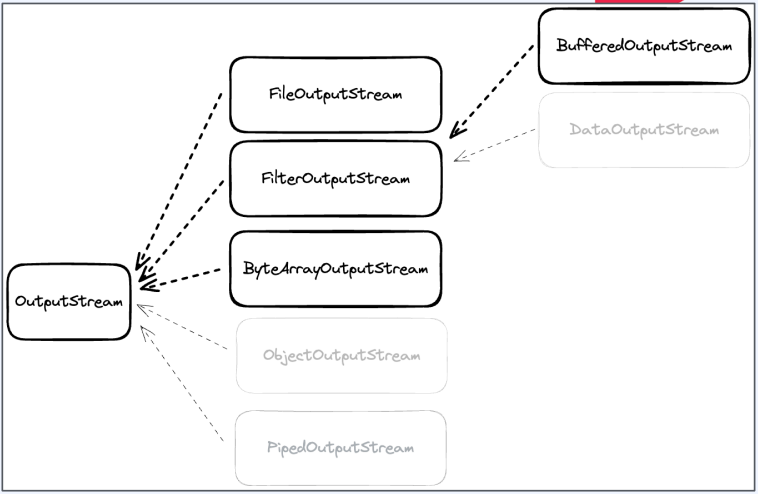

# JavaIO
- Java 1.0에서 처음 도입
- 파일과 네트워크에 데이터를 읽고 쓸 수 있는 API 제공
- byte단위로 일고 쓸 수 있는 stream(InputStream과 OutputStream) 
- blocking으로 동장


##   InputStream
- Closable 구현. 명시적으로 close하거나 try-with-resources 사용가능
- `read` : stream으로 데이터를 읽고, 읽은 값을 반환, -1이라면 끝에 도달했다는 것을 의미
- `close` : stream을 닫고 더 이상 데이터를 읽지 않는다.
- 어떤 source로 부터 데이터를 읽을지에 따라 다양한 구현체 존재  => `FileInputStream, ByteArrayInputStream, BufferedInputStream`
```java
public abstract class InputStream implements Closeable {
```

### ByteArrayInputStream
- byte array로부터 값을 읽을 수 있다.
- 메모리가 source가 된다.

```java
import java.io.ByteArrayInputStream;

class Test {
    public static void main(String[] args) {
        var bytes = new byte[]{100, 101, 102, 103, 104};

        try (var bais = new ByteArrayInputStream(bytes)) {
            var values = bais.readAllBytes(); // 한번에 읽고 출력
            System.out.println(values);
        }
    }
}
```

### FileInputStream
- file로부터 byte단위로 값을 읽을 수 있다.
- file객체나 path를 통해서 FileInputStream을 열 수 있다.
- application에서 blocking이 일어난다.

```java
import java.io.File;
import java.io.FileInputStream;

class Test {
    public static void main(String[] args) {
        var file = new File(FileInputStreamExample.class)
                .getClass()
                .getClassLoader()
                .getResource("data.txt")
                .getFile();
        try (var fis = new FileInputStream(file)) {
            var value = 0;
            
            while ((value = fis.read()) != -1){
                System.out.println((char)value);
            }
        }
    }
}
```

### BufferedInputStream
- 다른 inputStream과 조합해서 사용
- 임시 저장공간인 buffer를 사용
- 한번 read를 호출할 때 buffer 사이즈만큼 미리 조회
- 그 이루 read를 호출할 때 미리 저장한 buffer데이터 반환

```java
import java.io.BufferedInputStream;
import java.io.File;
import java.io.FileInputStream;

class Test {
    public static void main(String[] args) {
        var file = new File(BufferedInputStream.class)
                .getClass()
                .getClassLoader()
                .getResource("data.txt")
                .getFile();

        try (var fis = new FileInputStream(file)) {
            try (var bis = new BufferedInputStream(fis)) {
                var value = 0;

                while ((value = bis.read()) != -1) {
                    System.out.println((char) value);
                }
            }
        }

    }
}
```

### ServerSocket 

#### accept
- serverSocket을 open하여 외부의 요청을 수신
- bind, accept를 통해서 serverSocket open을 준비  


#### socket read
- accept가 끝나면 반환값으로 client의 socket을 전달
- client socket의 getInputStream으로 socket의 inputStream 접근

#### SocketInputStream
- SocketInputStream은 public이 아니기 때문에 직접 접근이 불가능
- socket.getInputStream으로만 접근 가능
- blocking이 발생

```java
import java.io.BufferedInputStream;
import java.io.InputStream;
import java.net.ServerSocket;
import java.net.Socket;

class Test {
    public static void main(String[] args) {

        ServerSocket serverSocket = new ServerSocket(8080);
        Socket clientSocket = serverSocket.accept();

        var inputStream = clientSocket.getInputStream();

        try (BufferedInputStream bis = new BufferedInputStream(inputStream)) {
            byte[] buffer = new byte[1024];
            int bytesRead = bis.read(buffer);
            String inputLine = new String(buffer, 0, bytesRead);
            System.out.println(inputLine);
        }
        clientSocket.close();
        serverSocket.close();
    }
}
```

## OutputStream
- write시 바로 전송하지 않고 버퍼에 저장한 다음 일정량의 데이터가 모이면 한번에 전달
- Closable 구현. 명시적으로 close하거나 try-with-resources 사용 가능
  - write: stream으로 데이터를 쓴다
  - flush: 버퍼의 모든 데이터를 출력하고 비운다
  - close: stream을 닫고 더 이상 쓰지 않는다
```java
public abstract class OutputStream implements Closeable, Flushable {
    public abstract void write(int b) throws IOException;
    public void flush() throws IOException {}
    public void close() throws IOException {}
}
```
- 어떤 destination에 데이터를 쓸 지에 따라 다양한 구현체 존재  

  

### ByteArrayOutputStream
- byte array에 값을 쓸 수 있다
- 메모리가 destination이 된다
```java
try (var baos = new ByteArrayOutputStream()) {
     baos.write(100);
     baos.write(101);
     baos.write(102);
     baos.write(103);
     baos.write(104);
     var bytes = baos.toByteArray();
     log.info("bytes: {}", bytes);
}

/*
   36:41 [main] - start main
   36:41 [main] - bytes: [100, 101, 102, 103, 104]
   36:41 [main] - end main
 * */
```

### FileOutputStream
- file에 값을 쓸 수 있다
- File 객체나 path를 통해서 FileOutputStream을 열 수 있다
- application에서 blocking 이 일어난다
```java
var file = new File(FileOutputStreamExample.class
                                           .getClassLoader()
                                           .getResource("dest.txt")
                                           .getFile());
try (var fos = new FileOutputStream(file)) {
     var content = "Hello World";
     fos.write(content.getBytes());
     fos.flush();
}
```

### BufferedOutputStream
- 다른 outputStream과 조합해서 사용
- Buffer를 사용
- 한 번 write를 호출하면 buffer에만 write
- 추후에 flush하여 한번에 outputStream에 write
```java
var file = new File(BufferedOutputStreamExample.class
                                               .getClassLoader()
                                               .getResource("dest2.txt")
                                               .getFile());
var fos = new FileOutputStream(file);
try (var bos = new BufferedOutputStream(fos)) {
     var content = "Hello World in buffered";
     bos.write(content.getBytes());
     bos.flush();
}
```

### SocketOutputStream
```java
// 서버 소켓 생성
ServerSocket serverSocket = new ServerSocket(8080);
// 클라이언트 접속 대기
Socket clientSocket = serverSocket.accept();

byte[] buffer = new byte[1024];
clientSocket.getInputStream().read(buffer);

var outputStream = clientSocket.getOutputStream();
var bos = new BufferedOutputStream(outputStream);
var bytes = "Hello World".getBytes();
bos.write(bytes);
bos.flush();

// 클라이언트 소켓 닫기
clientSocket.close();
// 서버 소켓 닫기
serverSocket.close();
```

### Java IO Reader와 Writer
- Java 1.1 에서 도입
- character 단위로 읽고 쓸 수 있는 stream (Reader와 Writer)
- 문자 인코딩 지원
- blocking으로 동작

> FileReader
```java
var file = new File(FileReaderExample.class
                                     .getClassLoader()
                                     .getResource("koreanhello.txt").getFile());
var charset = StandardCharsets.UTF_8;
try (var fis = new FileReader(file, charset)) {
   var value = 0;
   while ((value = fis.read()) = -1) {`
       log.info("value: {}", (char)value);
   }
}
```

> FileWriter
```java
var file = new File(FileWriterExample.class
                                     .getClassLoader()
                                     .getResource("koreanhello2.txt").getFile());
var charset = StandardCharsets.UTF_8;
try (var fis = new FileWriter(file, charset)) {
     var content = "안녕하세요 by FileWriter";
     fis.write(content);
}
```

### Java IO의 한계
- 동기 blocking 으로 동작
  - application이 read를 호출하면, kernel이 응 답을 돌려줄때까지, 아무것도 할 수 없다
  - I/O 요청이 발생할 때마다 쓰레드를 새로 할당 하면, 쓰레드를 생성 및 관리하는 비용과 컨텍스트 스위칭으로 인한 cpu 자원 소모
- 커널 버퍼에 직접 접근 불가. 따라서 메모리 copy가 발생
  - hardware에서 값을 읽어오면, disk
  - controller가 DMA를 통해서 커널 버퍼에 값 을 복사
  - 커널 버퍼에서 jvm 버퍼로 복사
  - 이 과정에서 cpu 자원을 소모
  - jvm 버퍼, jvm 메모리에 있기 때문에 gc 대상이 되고 이는 또한 cpu 자원을 소모  


