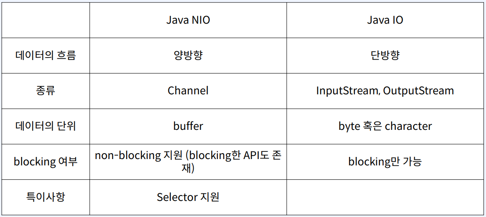

# Java NIO란?
- java New Input//Output (non-blocking x)  
- java 1.4 에서 처음 도입  
- 파일과 네트워크에 데이터를 읽고 쓸 수 있는 API 제공  
- buffer 기반  
- non-blocking 지원  
- selector, channel 도입으로 높은 성능 보장  


## Java NIO vs Java IO  


## Channel과 Buffer
- `데이터를 읽을 때`: 적절한 크기의 Buffer를 생 성하고 Channel의 read() 메서드를 사용하여 데이터를 Buffer에 저장.  
- `데이터를 쓸 때`: 먼저 Buffer에 데이터를 저장 하고 Channel의 write() 메서드를 사용하여 목적지로 전달  
- clear() 메서드로 초기화하여 다시 사용 가능  

## Buffer 종류
- `ByteBuffer`: byte 단위로 데이터를 읽고 쓴다  
- `CharBuffer`: char 단위  
- `ShortBuffer`: short 단위  
- `IntBuffer`: int 단위  
- `LongBuffer`: long 단위  
- `FloatBuffer`: float 단위  
- `DoubleBuffer`: double 단위

## Buffer 위치 속성
- `capacity`: Buffer가 저장할 수 있는 데이터의 최대 크기. Buffer 생성시 결정되며 변경 불가  
- `position`: Buffer에서 현재 위치를 카리킨다. 버퍼에서 데이터를 읽거나 쓸 때, 해당 위 치부터 시작. Buffer에 1Byte가 추가될 때마다 1 증가  
- `limit`: Buffer에서 데이터를 읽거나 쓸 수 있는 마지막 위치. limit 이후로 데이터를 읽거 나 쓰기 불가. 최초 생성시 capacity와 동일  
- `mark`: 현재 position 위치를 mark()로 지정할 수 있고 reset() 호출시 position을 mark로 이동  
- `flip`: Buffer의 limit 위치를 현재 position 위치로 이동시키고, position을 0으로 리셋 Buffer를 쓰기 모드에서 읽기 모드로 전환하는 경우 사용
- `rewind`: Buffer의 position 위치를 0으로 리셋. limit은 유지, 데이터를 처음부터 다시 읽는 경우 사용
- `clear` : Buffer의 limit 위치를 capacity 위치로 이동시키고, position을 0으로 리셋, Buffer를 초기화할 때 사용
```java
try (var fileChannel = FileChannel.open(file.toPath())) {
        var byteBuffer = ByteBuffer.allocateDirect(1024);
        logPosition("allocate", byteBuffer);
        
        // file로부터 값을 읽어서 byteBuffer에 write
        fileChannel.read(byteBuffer);
        logPosition("write", byteBuffer);
        
        // flip()을 호출하여 읽기모드로 전환
        byteBuffer.flip();
        logPosition("flip1", byteBuffer);
        
        // 읽기모드로 전환하여 처음부터 limit(마지막까지 write한 위치까지)까지 읽음
        var result = StandardCharsets.UTF_8.decode(byteBuffer);
        log.info("result: {}", result);
        logPosition("read1", byteBuffer);
        
        byteBuffer.rewind();
        logPosition("rewind", byteBuffer);
        
        var result2 = StandardCharsets.UTF_8.decode(byteBuffer);
        log.info("result2: {}", result2);
        logPosition("read2", byteBuffer);
        
        var result3 = StandardCharsets.UTF_8.decode(byteBuffer);
        log.info("result3: {}", result3);
        logPosition("read3", byteBuffer);
        
        byteBuffer.clear();
        logPosition("clear", byteBuffer);
        }
```


# . Java NIO에서 커널 버퍼에 직접 접근?

## DirectByteBuffer
- native 메모리(off-heap)에 저장
- 커널 메모리에서 복사를 하지 않으므로 데이터를 읽고 쓰는 속도가 빠르다
- 비용이 많이 드는 system call을 사용하므로 allocate, deallocate가 느리다

## HeapByteBuffer
- JVM heap 메모리에 저장. byte array를 랩핑
- 커널 메모리에서 복사가 일어나므로 데이터를 읽고 쓰는 속도가 느리다
- (이 과정에서 임시로 Direct Buffer를 만들기 때문에 성능 저하)
- gc에서 관리가 되므로 allocate, deallocate가 빠르다

## ByteBuffer 구분
- `DirectByteBuffer`: allocateDirect() 함수로 생성 가능
- `HeapByteBuffer`: allocate(), wrap() 함수로 생성 가능
- `isDirect()`로 구분 가능

## FileChannel - read
```java
var file = new File(FileChannelReadExample.class
                         .getClassLoader()
                         .getResource("hello.txt")
                         .getFile());
try (var fileChannel = FileChannel.open(file.toPath())) {
     var byteBuffer = ByteBuffer.allocateDirect(1024);
     fileChannel.read(byteBuffer);
     byteBuffer.flip();
     var result = StandardCharsets.UTF_8.decode(byteBuffer);
     log.info("result: {}", result);
}
```

## FileChannel - write
```java
var file = new File(FileChannelWriteExample.class
                         .getClassLoader()
                         .getResource("hello.txt")
                         .getFile());
var mode = StandardOpenOption.WRITE;
try (var fileChannel = FileChannel.open(file.toPath(), mode)) {
         var byteBuffer = ByteBuffer.wrap("hello world2".getBytes());
         var result = fileChannel.write(byteBuffer);
         log.info("result: {}", result);
}
```

## SocketChannel - read, write
```java
try (var socketChannel = SocketChannel.open()) {
     var address = new InetSocketAddress("localhost", 8080);
     var connected = socketChannel.connect(address);
     log.info("connected: {}", connected);
     
     String request = "This is client.";
     ByteBuffer requestBuffer = ByteBuffer.wrap(request.getBytes());
     socketChannel.write(requestBuffer);
     requestBuffer.clear();
     
     ByteBuffer res = ByteBuffer.allocateDirect(1024);
     while (socketChannel.read(res) > 0) {
         res.flip();
         log.info("response: {}", StandardCharsets.UTF_8.decode(res));
         res.clear();
     }
}
```

## ServerSocketChannel - read, write
```java
try (var serverChannel = ServerSocketChannel.open()) {
     var address = new InetSocketAddress("localhost", 8080);
     serverChannel.bind(address);
     
     try (var clientSocket = serverChannel.accept()) {
         ByteBuffer buffer = ByteBuffer.allocateDirect(1024);
         clientSocket.read(buffer);
         buffer.flip();
         
         var request = new String(buffer.array()).trim();
         log.info("request: {}", request);
         
         var response = "This is server.";
         var responseBuffer = ByteBuffer.wrap(response.getBytes());
         clientSocket.write(responseBuffer);
         responseBuffer.flip();
     }
}
```

# Java NIO를non-blocking하게 쓰려면? SelectableChannel
- SocketChannel, ServerSocketChannel 모두 AbstractSelectableChannel을 상속
- AbstractSelectableChannel은 SelectableChannel을 상속
> configureBlocking 과 register 함수 제공
> `onfigureBlocking`: serverSocketChannel의 accept, socketChannel의 connect 등이 non-blocking으로 동작한다


## ## ServerSocketChannel 과 SocketChannel의 non-Blocking accept, connect
```java
try (var serverChannel = ServerSocketChannel.open()) {
     var address = new InetSocketAddress("localhost", 8080);
     serverChannel.bind(address);
     serverChannel.configureBlocking(false);
     
     var clientSocket = serverChannel.accept();
     assert clientSocket = null; // 바로동작
}
```
```java
try (var socketChannel = SocketChannel.open()) {
        var address = new InetSocketAddress("localhost", 8080);
        socketChannel.configureBlocking(false);
        var connected = socketChannel.connect(address);
        assert !connected; // 바로동작
}
```


